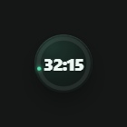
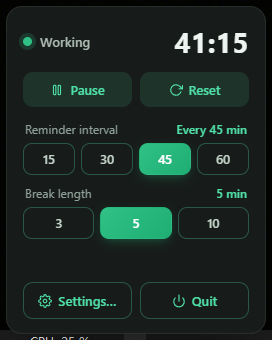
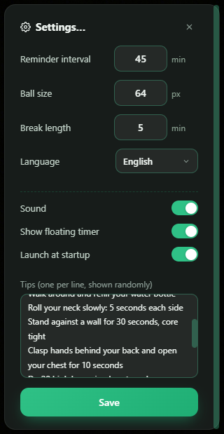
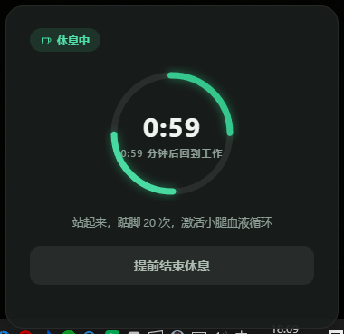

# Sit Break · 久坐提醒

[](https://github.com/yuexiaoliang/sit-break)
[](https://tauri.app)
[](https://www.rust-lang.org)
[](LICENSE)
[](../../releases)
[](../../actions/workflows/ci.yml)

**小巧、美观、好用的 Windows 久坐提醒工具。** Sit Break 常驻系统托盘安静倒计时，到点弹出提醒让你起来活动——忘记起身才是腰酸背痛的开始。

[English](README.md) | 简体中文

<!-- 关键词：久坐提醒、坐姿提醒、休息提醒、悬浮倒计时、系统托盘、Windows 11、Tauri、Rust -->

## 截图

<p align="center">
  
</p>

<table>
  <tr>
    <td align="center"></td>
    <td align="center"></td>
  </tr>
  <tr>
    <td align="center">托盘面板</td>
    <td align="center">设置</td>
  </tr>
  <tr>
    <td align="center"></td>
    <td align="center"></td>
  </tr>
  <tr>
    <td align="center">久坐提醒</td>
    <td align="center">休息倒计时</td>
  </tr>
</table>

## 为什么选 Sit Break

- **小巧**：独立 exe 仅 4 MB；空闲时**零窗口、零 WebView**，只剩托盘图标和悬浮球
- **美观**：毛玻璃悬浮球 + 实时读秒 + 渐变进度圆环 + 随倒计时移动的发光点
- **聪明**：系统级空闲检测——离开接杯水，计时自动重置，离开的时间不算久坐
- **双语**：中文 / English 界面，跟随系统语言，也可手动切换

## 功能

| | |
|---|---|
| ⏱ 悬浮倒计时球 | 常驻置顶、可拖动、滚轮调大小（40–140px）、位置自动记忆 |
| 🔔 久坐提醒弹窗 | 右下角毛玻璃卡片，随机活动小建议，可"再等等" |
| 🧘 休息倒计时 | 圆环进度，休息结束自动恢复工作计时 |
| ↻ 一键重置 | 托盘面板 / 悬浮球随时重置计时 |
| 💤 空闲检测 | 超过 2 分钟无键鼠输入自动重置计时 |
| 🚀 开机自启 | 设置里一键开关 |
| 🔔 提示音 | 提醒弹出时轻响两声（可关） |
| ✏️ 自定义提醒小字 | 每行一条、随机展示，支持自定义列表 |
| 🌐 中文 / English | 跟随系统语言，或手动选择 |

## 下载

前往 [Releases](../../releases) 获取最新版本：

- `Sit Break_x.y.z_x64-setup.exe` — NSIS 安装包
- `Sit Break_x.y.z_x64_en-US.msi` — MSI 安装包
- `sit-break.exe` — 绿色便携版，免安装

> 需要 Windows 10/11 + WebView2（Windows 11 已内置）。

## 从源码构建

前置条件：[Node.js 18+](https://nodejs.org)、[Rust](https://rustup.rs)，Windows 上还需 [MSVC 构建工具](https://visualstudio.microsoft.com/visual-cpp-build-tools/) 与 WebView2。

```bash
npm install
npm run tauri dev    # 开发调试
npm run tauri build  # 产物输出到 src-tauri/target/release
```

## 工作原理

```
工作计时 ──到点──▶ 提醒弹窗 ──开始休息──▶ 休息倒计时 ──结束──▶ 新一轮计时
   ▲                                                        │
   └──────────── 随时重置（托盘面板 / 悬浮球）◀──────────────┘
```

- 计时器、托盘、空闲检测、窗口管理全部在 **Rust 端**——后台无 WebView、无定时器节流，内存占用极小
- 悬浮球、提醒弹窗、设置窗均为按需创建的纯 UI 窗口

## 技术栈

[Tauri 2](https://tauri.app) · Rust · TypeScript · Vite —— 无 UI 框架，手写 CSS。

## CI 与发布

- **CI**（`.github/workflows/ci.yml`）：push / PR 自动执行前端类型检查与构建、`cargo check`、`cargo clippy`
- **Release**（`.github/workflows/release.yml`）：推送 `v*` 标签自动构建并发布 NSIS / MSI 安装包与便携版 exe 到 GitHub Releases

发布新版本只需一条命令（自动同步三处版本号、更新 Cargo.lock、commit + tag + push）：

```bash
npm run release -- patch   # 或 minor / major / 指定版本号如 1.2.3
# 先试跑不改文件：npm run release -- patch --dry-run
```

## 许可证

[MIT](LICENSE)
